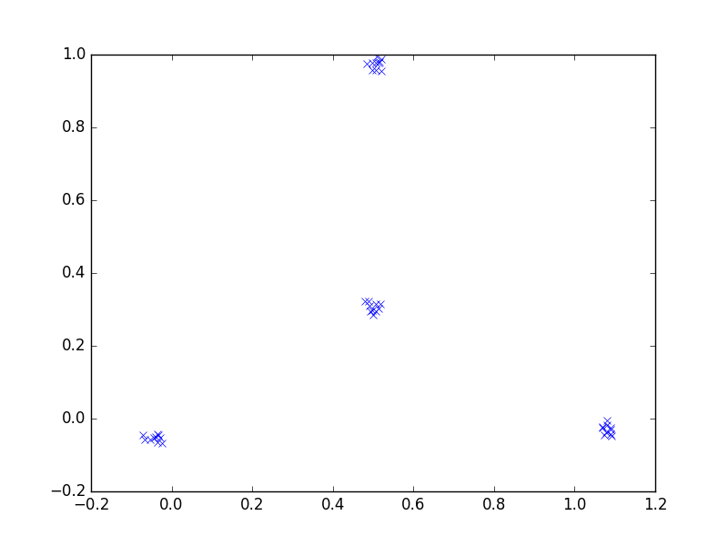

# Sammon Embedding

This repository is an implementation of Sammon Embedding algorithm for dimensionality reduction.

An example of using the embedding code is in [``tetrahedron.py``](tetrahedron.py) with a unit-length Tetrahedron as an example. The embedded points are plotted as follow:

# Reference

* John W. Sammon, Jr., "A Nonlinear Mapping for Data Structure Analysis," _IEEE Transactions on Computers_ __18__: 401-409 (1969).
* Wikipedia: Sammon Mapping. \[[link](https://en.wikipedia.org/wiki/Sammon_mapping)\]
* [Blog entry](https://datawarrior.wordpress.com/2016/10/23/sammon-embedding/).